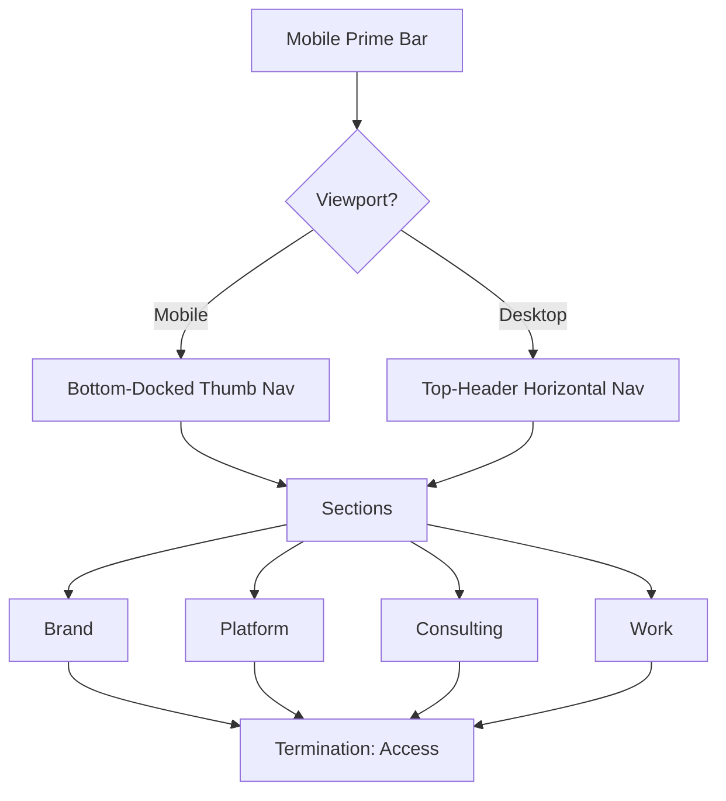

# PADAVANO // MOBILE PRIME PROTOCOL

[](LICENSE)
[](https://padavano.vercel.app)
[](https://padavano.vercel.app)

> Systems architecture and product engineering. Established 2026.

---

## 00 // MOTIVATION

Anthony James Padavano's consulting presence — a static landing site implementing the **Mobile Prime Protocol**. Mobile-native interactions as foundational directive; perfected secondary viewpoint for desktop.

- **Established, not new.**
- **Expensive, not flashy.**
- **Intentional, not vague.**
- **Quiet, not attention-seeking.**

---

## 01 // ARCHITECTURE



### Protocol Stack
- **Typography**: [Geist](https://vercel.com/font) (Sans & Mono)
- **Engine**: Pure HTML5 / CSS3 / JavaScript
- **Motion**: CSS View-Timeline (Scroll-Driven Animations)
- **Validation**: Playwright 1:x Testing Suite (40 tests)

---

## 02 // USAGE

```
/
├── .config/           # Tooling configurations (Playwright, Stylelint)
├── .github/           # Automated workflows
├── src/               # Core Protocol (HTML/Assets)
├── tests/             # 1:x Validation Suite (7 spec files)
└── README.md          # Access Node
```

```bash
npm install
npm test
npm run validate   # lint + test
```

---

## 03 // SERVICES

| ID | Service | Core Function |
|:---|:---|:---|
| 01 | **Brand** | Identity systems, web presence, visual architecture |
| 02 | **Platform** | AI orchestration, multi-agent systems, infrastructure |
| 03 | **Consulting** | Advisory, diagnostics, strategic architecture |
| 04 | **Work** | Deployed products and published portfolio |

---

## 04 // ACCESS

Engagements reviewed chronologically. Contact via the site form.

---

© 2026 Anthony James Padavano. All rights reserved.
