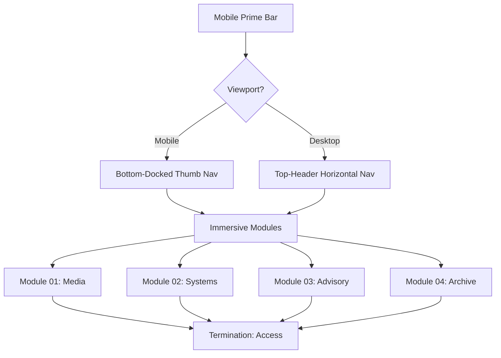

# PADAVANO // MOBILE PRIME PROTOCOL

[](LICENSE)
[](https://consilivm-simplex.vercel.app)
[](https://consilivm-simplex.vercel.app)

> Strategic Asset Architecture for the next digital epoch. Established 2026.

---

## 00 // MOTIVATION

The Padavano digital presence is an architectural machine designed for quiet authority and absolute precision. It implements the **Mobile Prime Protocol**, establishing mobile-native interactions as the foundational directive while delivering a perfected secondary viewpoint for desktop environments.

- **Established, not new.**
- **Expensive, not flashy.**
- **Intentional, not vague.**
- **Quiet, not attention-seeking.**

---

## 01 // ARCHITECTURE



### Protocol Stack
- **Typography**: [Geist](https://vercel.com/font) (Sans & Mono)
- **Engine**: Pure HTML5 / CSS3 / JavaScript
- **Motion**: CSS View-Timeline (Scroll-Driven Animations)
- **Validation**: Playwright 1:x Testing Suite

---

## 02 // USAGE

### Repository Protocol
Implementation details are isolated from the root to maintain architectural maturity.

```bash
/
├── .config/           # Tooling configurations (Playwright)
├── .github/           # Automated workflows
├── docs/              # Strategic documentation
├── src/               # Core Protocol (HTML/Assets)
├── tests/             # 1:x Validation Suite
└── README.md          # Access Node
```

### Active Development
```bash
# Initialize Environment
npm install

# Activate Validation
npm test
```

---

## 03 // MODULES

| ID | Module | Core Function |
|:---|:---|:---|
| 01 | **Media** | Presence Architecture & Bespoke Intel |
| 02 | **Systems** | Autonomous Infrastructure & Temporal Crons |
| 03 | **Advisory** | Diagnostic Intelligence & Asset Growth |
| 04 | **Archive** | Proprietary Records & Institutional Blueprints |

---

## 04 // ACCESS

Inquiries regarding diagnostic intelligence and systems architecture are reviewed chronologically. Access is restricted to established entities.

[Finalize Authority](https://consilivm-simplex.vercel.app/#close)

---

© 2026 PADAVANO. ALL RIGHTS RESERVED.
MODULAR PROTOCOL ACTIVATED.
